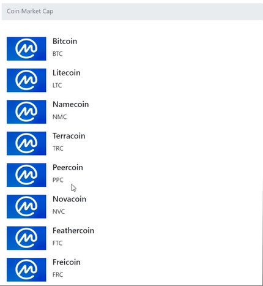

  

# Requisitando dados de uma API de criptomoedas

Aula ministrada por Bárbara Casac no curso da Digital Innovation One.

Fonte:
[Digital Innovation One(DIO)](https://digitalinnovation.one/)

## 🚀 Tecnologias

Esse projeto foi desenvolvido com as seguintes tecnologias:

- Projeto Web utilizando a API Coin Market Cap  
[Portal do desenvolvedor](https://pro.coinmarketcap.com/account)  
[Documetação de autenticação](https://coinmarketcap.com/api/documentation/v1/#section/Authentication)  
[Documentação API](https://coinmarketcap.com/api/documentation/v1/#)  

* [HTML básico](https://www.w3schools.com/html/)
* [CSS básico](https://stackpath.bootstrapcdn.com/bootstrap/4.1.3/css/bootstrap.min.css)

## 📃 License

This project is under MIT license. Check file [LICENSE](LICENSE) for more details.

---

<h4 align="center">
  Developed with ❤️ by <b>Douglas Rosa</b>
</h4>
